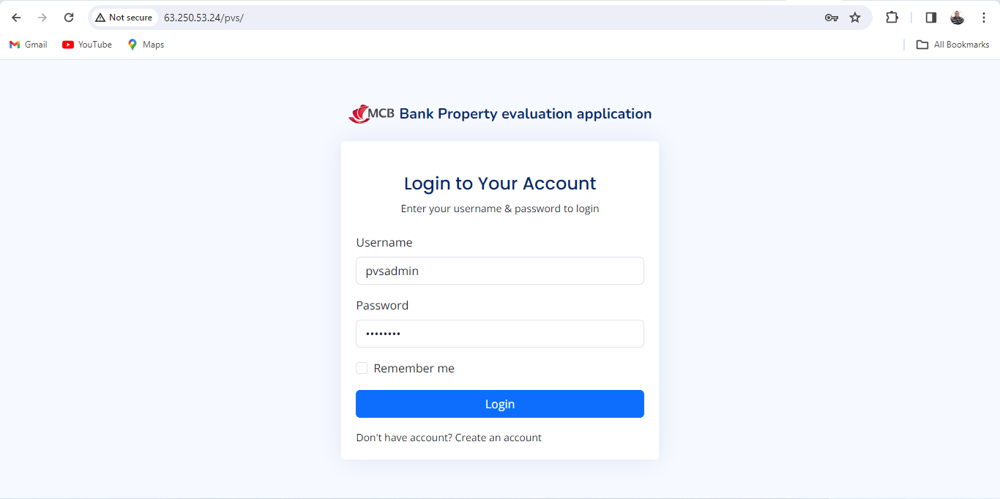
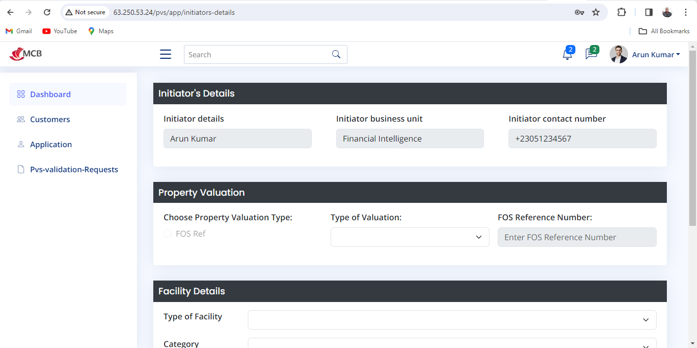

# Bank Property Valuation System

This project was generated with [Angular CLI](https://github.com/angular/angular-cli) version 16.1.5.

## Development Server

Run `ng serve` for a development server. Navigate to `http://localhost:4200/`. The application will automatically reload if you change any of the source files.

## Code Scaffolding

Run `ng generate component component-name` to generate a new component. You can also use `ng generate directive|pipe|service|class|guard|interface|enum|module`.

## Testing the Application

To test the application, visit the link:

[http://63.250.53.24/pvs/](http://63.250.53.24/pvs/)

Login with the default credentials:
- Username: pvsadmin
- Password: pvsadmin

## Screenshots

### Login Page

### Dashboard

